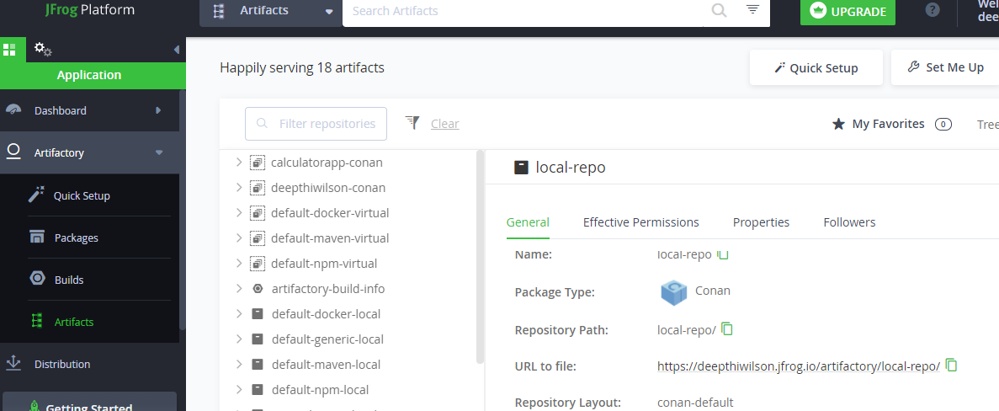

# Using Conan for C++ Pkg management with JFrog Repository

Contents conanfile.py
-----------------------------

Contents CMakeLists.txt
-----------------------------

Contents conanfile.txt
-----------------------------

JFROG UI
-----------------------------

After creating repo in jfrog, we can create a repo 

Conan Create 

Conan Search for the created repo 

Conan add the created artifact details to the project

Authorize Jfrog

Conan upload the artifact to Jfrog

Remove the local artifact and when trying conan install .. inside build folder it will search for jfrog repo and download from there

